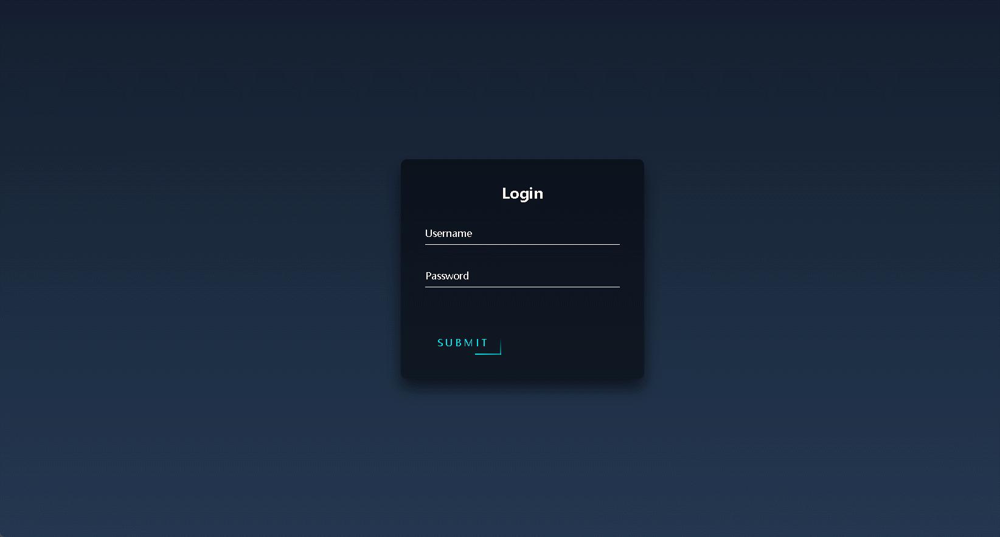

## 使用说明

备注：仅/[Source Code](https://github.com/TsinghuaSIGS/Share-React-Good-UI-Demo-2023-02/tree/master/Source%20Code/001-Login%20Page "This path skips through empty directories")内为有效文件，其他为本地演示环境。

---

## 如何新建React项目：

*要创建一个新的React项目，您可以遵循以下步骤：*

1. *确保您的计算机上安装了最新版本的Node.js和npm（Node.js的包管理器）。如果您还没有安装它们，请到官网下载并安装。*
2. *打开命令行终端并导航到您想要创建React项目的目录中。*
3. *运行以下命令来创建一个新的React项目：`npx create-react-app my-app`
4. *这将创建一个名为“my-app”的新React项目，并安装所需的依赖项。
5. 进入新创建的项目目录：`cd my-app`
6. 运行以下命令来启动开发服务器：`npm start`
7. 这将启动React开发服务器，并在浏览器中打开一个新窗口，以显示您的新应用程序。现在，您已经成功创建了一个新的React项目！

---

## 具体项目列表

### 001-Login Page（2023-02-16）

由CodePen开源代码改写而来，下面是页面演示，无依赖要求

原始HTML+CSS+JS版本：见仓库内 HTML+JS+CSS.zip

### 002-title（date）

to be continued...
